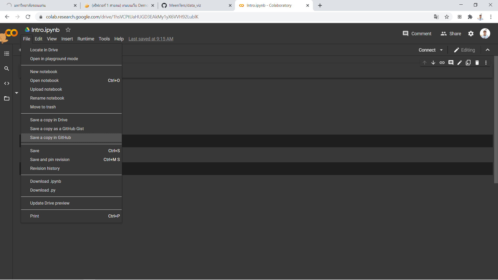
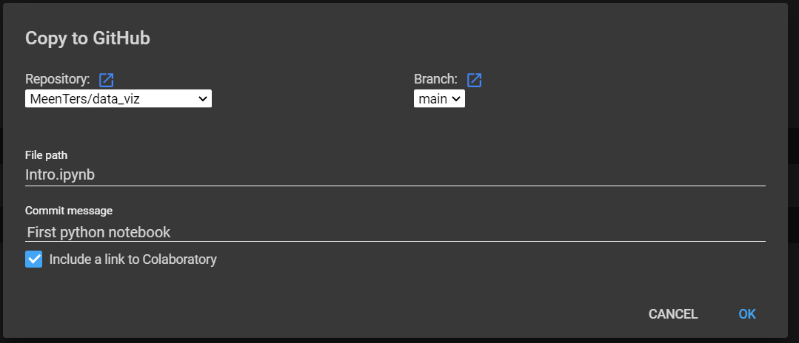

# data_viz

# ธนพล ทาโยธี 613020241-3

## example for insert image to github

## HW1

## ขั้นตอนการบันทึกcollab notebook มาไว้ที่ github

### ขั้นตอนที่ 1 ให้ทำการเลือกที่ File จากนั้นไปกดเลือกที่ Save a copy in GitHub

### ขั้นตอนที่ 2 เมื่อเข้ามาสู่หน้านี้เรียบร้อยแล้ว จะมีช่อง commit message ที่สามารถให้เราเขียนข้อความเพื่อให้เราทราบว่าการบันทึกครั้งนี้เราทำอะไรเพิ่มบ้าง 
### ซึ่งเราได้ทำการเขียนว่า First python notebook
### ขั้นตอนที่ 3 เมื่อทุกอย่างเรียบร้อยแล้วให้ทำการกด OK เพียงเท่านี้ก็เสร็จสิ้น
